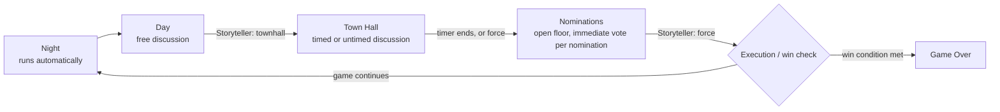

# Blood on the Clocktower — Automated Storyteller


A digital toolset for running games of **[Blood on the Clocktower](https://bloodontheclocktower.com/)** — a social deduction game where one Storyteller secretly assigns every player a character, and the players try to figure out who's lying before the game ends.

This project has two parts:

- A **rules engine** that knows the game inside and out — the Grimoire, the night order, every character's ability, nominations and voting, and win conditions — so a computer can adjudicate the game correctly instead of relying purely on a human Storyteller's memory.
- A **local multiplayer playtest tool** — a small server plus terminal clients — that lets you actually sit a table down (one Storyteller + several players, each on their own device) and play a full game against that engine right now.

> New to the project? Read [`docs/ARCHITECTURE.md`](docs/ARCHITECTURE.md) for the full system design and where this is headed.

---

## Table of contents

- [What's actually working today](#whats-actually-working-today)
- [Tech stack](#tech-stack)
- [Project structure](#project-structure)
- [Getting started](#getting-started)
- [Play a game](#play-a-game)
- [How the engine thinks](#how-the-engine-thinks)
- [Testing](#testing)
- [Roadmap](#roadmap)

---

## What's actually working today

| | Status |
|---|---|
| Core rules engine (Trouble Brewing script, all 13 characters) | ✅ Done, unit + simulation tested |
| Local multiplayer playtest tool (Socket.IO server + terminal clients) | ✅ Working end-to-end |
| Structured phase loop (Night → Day → Town Hall → Nominations) | ✅ Working, Storyteller-controlled |
| Player-facing web/mobile app | 🚧 Not started — see the roadmap |
| Fully automated Storyteller (no human judgment calls) | 🚧 Not started — a human Storyteller currently makes the calls the rules leave to them |

## Tech stack

| Layer | Choice | Why |
|---|---|---|
| Language | **TypeScript**, strict mode, everywhere | One type system across the whole engine and its clients |
| Runtime | **Node.js** (v20+) | |
| Monorepo | **pnpm workspaces** | Simple, no extra build-orchestration tooling needed at this size |
| Game engine | Plain TypeScript, no framework | Deliberately headless — no networking baked in, so it's fully unit-testable |
| Playtest networking | **Socket.IO** (server + client) | Rooms, reconnection primitives, and a simple event model, matching the intended production architecture |
| Playtest CLIs | **Node.js + [tsx](https://github.com/privatenumber/tsx)** | Runs the TypeScript sources directly, no separate build step while iterating |
| Testing | **Vitest** | Fast, native ESM/TS support |

## Project structure

```
BOC_Game/
├── docs/
│   └── ARCHITECTURE.md        # Full system design: engine, protocol, deployment
├── .claude/skills/             # BOTC rules reference the engine is built and verified against
│   ├── botc-rules/             #   script-agnostic rules (setup, voting, states, win conditions)
│   └── botc-trouble-brewing/   #   every Trouble Brewing character's exact ability + night order
├── packages/
│   ├── shared/                  # Character/script data, shared types, decision-provider
│   │   └── src/                 # interfaces, a seedable RNG - no game logic lives here
│   ├── server/                  # The headless rules engine
│   │   ├── src/engine/          #   Grimoire, setup/dealing, night & day engines, win conditions
│   │   └── test/                #   70 tests: every character, edge cases, a full-game simulation suite
│   └── playtest/                # Socket.IO server + terminal clients to actually play
│       └── src/
│           ├── server.ts            # Game orchestration + socket protocol
│           ├── playerClient.ts      # CLI a player runs on their own device
│           ├── storytellerClient.ts # CLI the Storyteller runs
│           └── networkProviders.ts  # Bridges the engine's decision hooks over sockets
├── pnpm-workspace.yaml
└── package.json
```

## Getting started

```bash
git clone <this repo>
cd BOC_Game
pnpm install     # install every workspace package's dependencies
pnpm build       # compile packages/shared and packages/server
pnpm test        # run the full engine test suite (70 tests)
```

## Play a game

The playtest tool needs **one server process** plus **one terminal per person at the table** — a Storyteller and however many players you're testing with.

**1. Start the server** (from the repo root):

```bash
pnpm --filter @boc/playtest run server -- --players 5
```

| Flag | Default | Meaning |
|---|---|---|
| `--players <n>` | `5` | How many players to wait for before dealing |
| `--port <n>` | `3131` | Port to listen on |
| `--seed <n>` | random | Fixes the character deal, for reproducible testing |
| `--townhall-seconds <n>` | `120` | Default Town Hall discussion timer (`0` = untimed by default) |

**2. Start the Storyteller** (one terminal):

```bash
pnpm --filter @boc/playtest run storyteller
```

**3. Start each player** (one terminal per player):

```bash
pnpm --filter @boc/playtest run player
```

Each player types a name; once everyone (players + Storyteller) has connected, the deal happens automatically.

### The flow



### Commands

**Players**, once their role is shown:

| Command | Effect |
|---|---|
| `ready` | Confirms you've read your role — the game won't start Night 1 until everyone has |
| `nominate <name>` | Nominate a player (Nominations phase only) |
| `pass` | Nothing to nominate right now — you can still act again later this phase |
| `vote <#>` | Vote in favor of nomination `#` |
| `slayer <name>` | Use the Slayer's once-per-game power |
| `status` | Re-print the current game state |

**Storyteller**:

| Command | Effect |
|---|---|
| `help` | List every Storyteller command |
| `townhall` / `townhall <seconds>` / `townhall off` | Start Town Hall, with the default timer, a custom one, or untimed |
| `force` | End the current Town Hall or Nominations stage immediately |
| *(free text)* | Answers whatever `[DECISION NEEDED]` prompt is currently showing |

Idle clients show a periodic "waiting on..." reminder, and every server action is logged with a timestamp. If the server goes down, connected clients detect it and exit cleanly instead of hanging.

## How the engine thinks

The engine (`packages/server`) is deliberately **headless** — it has no idea Socket.IO exists. It's driven entirely through:

- A `Grimoire` — the single source of truth for every player's true character, alignment, and status.
- A `StorytellerDecisionProvider` — every rules-defined "the Storyteller decides, not the player" moment (picking the Fortune Teller's Red Herring, resolving a misregistering Recluse/Spy, wording a Mayor redirect, and so on) goes through this interface. The playtest tool's implementation forwards these to the human Storyteller's terminal; a future fully-automated mode plugs in here with no engine changes.
- A `PlayerChoiceProvider` — the player-facing counterpart, for every ability a player actively chooses a target for.

This split is what makes the engine testable without a network in the loop at all — see `packages/server/src/testUtils` for the scripted and randomized test doubles used in the test suite below.

Character behavior is built directly from the `.claude/skills/botc-trouble-brewing` reference, with two deliberate, explicitly-flagged departures from tabletop rules (see the code comments and that skill file for details): nominations aren't capped at one-per-day, and Minions aren't automatically told who the Demon is.

## Testing

```bash
pnpm test          # every package
pnpm --filter @boc/server test   # just the engine
```

The engine suite (70 tests) covers every character's ability (including drunk/poisoned variants), night-order sequencing, day/nomination/voting edge cases, kill resolution (Monk/Soldier/Mayor/Scarlet Woman/Imp promotion), and win conditions — plus a seeded **full-game simulation suite** that has been stress-tested across 1,100+ randomized games (5–15 players) with zero failures.

## Roadmap

Roughly in order:

1. A real player-facing client (web or mobile) to replace the terminal CLI.
2. A fully-automated `StorytellerDecisionProvider` implementation, so games can run with no human Storyteller.
3. Reconnect support (a disconnected player's future prompts currently just silently fall back to a default choice instead of waiting for them).
4. Additional scripts beyond Trouble Brewing.
5. Internet-hosted play (the playtest tool is LAN/localhost-first today; see `docs/ARCHITECTURE.md` for why it's already built to make that an easy next step).
